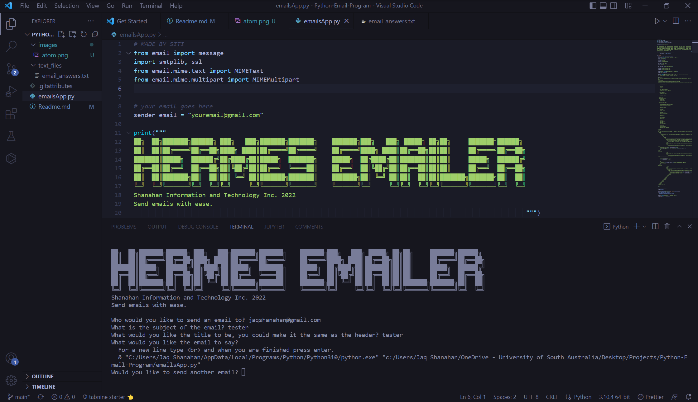

<a name="readme-top"></a>
<!-- PROJECT LOGO -->
<br />
<div align="center">
  <a href="https://github.com/JaqShanahan/Python-Email-Program">
    
  </a>

  <h3 align="center">Hermes Emailer</h3>

  <p align="center">
    This tool/project is apart of the Hermes().Suite a collective set of tools that aid in developing better AI
    <br />
    <a href="https://github.com/JaqShanahan/Python-Email-Program"><strong>Explore the docs »</strong></a>
    <br />
    <br />
    <a href="https://github.com/JaqShanahan/Python-Email-Program">View Demo</a>
    ·
    <a href="https://github.com/JaqShanahan/Python-Email-Program/issues">Report Bug</a>
    ·
    <a href="https://github.com/JaqShanahan/Python-Email-Program/issues">Request Feature</a>
  </p>
</div>

<!-- TABLE OF CONTENTS -->
<details>
  <summary>Table of Contents</summary>
  <ol>
    <li>
      <a href="#about-the-project">About The Project</a>
      <ul>
        <li><a href="#built-with">Built With</a></li>
      </ul>
    </li>
    <li>
      <a href="#getting-started">Getting Started</a>
      <ul>
        <li><a href="#prerequisites">Prerequisites</a></li>
        <li><a href="#installation">Installation</a></li>
      </ul>
    </li>
    <li><a href="#usage">Usage</a></li>
    <li><a href="#roadmap">Roadmap</a></li>
    <li><a href="#contributing">Contributing</a></li>
    <li><a href="#license">License</a></li>
    <li><a href="#contact">Contact</a></li>
    <li><a href="#acknowledgments">Acknowledgments</a></li>
  </ol>
</details>

<!-- ABOUT THE PROJECT -->

## About The Project



This project/tool is used to generate beutiful looking emails from the python terminal. This project includes the following features that are available for developers.

Here's why:

- You should not have to pay for expensive email services to send nice looking emails.
- You shouldn't be doing the same tasks over and over like creating emails yourself.

<p align="right">(<a href="#readme-top">back to top</a>)</p>

### Built With

This project is built with the following features:

## **Python** >= 3.10.4

python is the online programming language in this project.

<p align="right">(<a href="#readme-top">back to top</a>)</p>

<!-- GETTING STARTED -->

## Getting Started

To get a local copy up and running follow these simple example steps.

### Prerequisites

No prerequisites are required for this project.

### Installation

_Below is how you you can access this tool. It is freely and readily accessible with more features to be added in the future._

1. Clone the repo
   ```sh
   git clone https://github.com/JaqShanahan/Python-Email-Program.git
   ```

<p align="right">(<a href="#readme-top">back to top</a>)</p>

<!-- USAGE EXAMPLES -->

## Usage

This project/tool is under a free license as we believe that it should be free software and subject to the MIT License.

<p align="right">(<a href="#readme-top">back to top</a>)</p>

<!-- ROADMAP -->

## Roadmap

- [ ] Add Changelog
- [ ] Add back to top links
- [ ] Add more customizations

See the [open issues](https://github.com/JaqShanahan/Python-Email-Program/issues) for a full list of proposed features (and known issues).

<p align="right">(<a href="#readme-top">back to top</a>)</p>

<!-- CONTRIBUTING -->

## Contributing

Contributions are what make the open source community such an amazing place to learn, inspire, and create. Any contributions you make are **greatly appreciated**.

If you have a suggestion that would make this better, please fork the repo and create a pull request. You can also simply open an issue with the tag "enhancement".
Don't forget to give the project a star! Thanks again!

1. Fork the Project
2. Create your Feature Branch (`git checkout -b feature/AmazingFeature`)
3. Commit your Changes (`git commit -m 'Add some AmazingFeature'`)
4. Push to the Branch (`git push origin feature/AmazingFeature`)
5. Open a Pull Request

<p align="right">(<a href="#readme-top">back to top</a>)</p>

<!-- LICENSE -->

## License

Distributed under the MIT License. See `LICENSE.txt` for more information.

<p align="right">(<a href="#readme-top">back to top</a>)</p>

<!-- CONTACT -->

## Contact

Your Name - [@JaqShanahan](https://www.linkedin.com/in/jaq-shanahan-a327ba21a/) - jaqshanahan@gmail.com

Project Link: [https://github.com/JaqShanahan/Python-Email-Program](https://github.com/JaqShanahan/Python-Email-Program)

<p align="right">(<a href="#readme-top">back to top</a>)</p>

<!-- ACKNOWLEDGMENTS -->
